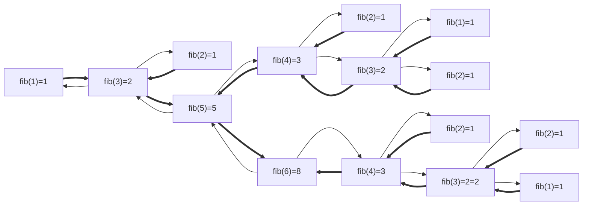

```mermaid
flowchart LR
    6["fib(6)=8"] --> 64["fib(4)=3"] ==> 6
    6 --> 65["fib(5)=5"] ==> 6
    65 --> 54["fib(4)=3"]  ==> 65
    65 --> 53["fib(3)=2"]  ==> 65
    54 --> 43["fib(3)=2"] ==> 54
    54 --> 42["fib(2)=1"] ==> 54
    43 --> 32["fib(2)=1"] ==> 43
    43 --> 31["fib(1)=1"] ==> 43
    53 --> 2["fib(2)=1"] ==> 53
    53 --> 1["fib(1)=1"] ==> 53
    64 --> 443["fib(3)=2=2"] ==> 64
    64 --> 442["fib(2)=1"] ==> 64
    443 --> 332["fib(2)=1"] ==> 443
    443 --> 331["fib(1)=1"] ==> 443
```